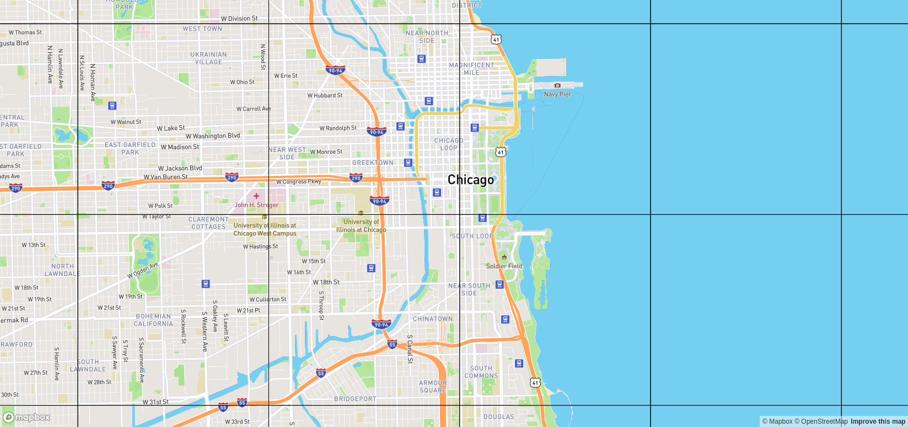

# mapspecs

Visualize slippy tile extents and display vector tile metadata (number of layers, features, etc).



It doesn't do much at the moment. Tile stats are currently only printed to console. More ideas to follow.

```json
{"tile":"13/2103/3045","layers":[{"name":"road","numKeys":8,"numFeatures":31},{"name":"water","numKeys":0,"numFeatures":1},{"name":"landuse","numKeys":3,"numFeatures":2},{"name":"place_label","numKeys":23,"numFeatures":1},{"name":"waterway","numKeys":4,"numFeatures":1},{"name":"contour","numKeys":2,"numFeatures":1}]}
```

Inspired by [What the tile?](https://labs.mapbox.com/what-the-tile/).
